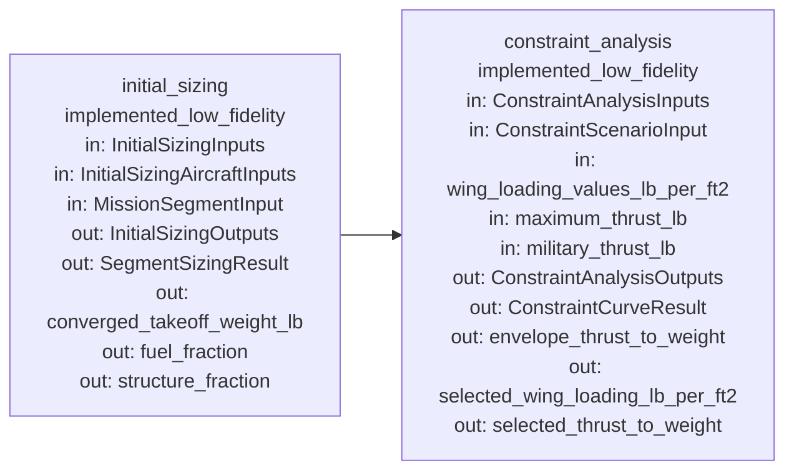

# Current Module Map

Generated from `mbse_core.module_registry`.

## Registered Modules

### initial_sizing

- Package: `domains.initial_sizing`
- Status: `implemented_low_fidelity`
- Purpose: Run MaCa-style low-fidelity mission fuel fraction and takeoff weight convergence.
- Inputs: InitialSizingInputs, InitialSizingAircraftInputs, MissionSegmentInput
- Outputs: InitialSizingOutputs, SegmentSizingResult, converged_takeoff_weight_lb, fuel_fraction, structure_fraction
- Downstream modules: constraint_analysis

### constraint_analysis

- Package: `domains.constraint_analysis`
- Status: `implemented_low_fidelity`
- Purpose: Evaluate MaCa-style thrust-loading versus wing-loading constraint curves and select a low-fidelity design point.
- Inputs: ConstraintAnalysisInputs, ConstraintScenarioInput, wing_loading_values_lb_per_ft2, maximum_thrust_lb, military_thrust_lb
- Outputs: ConstraintAnalysisOutputs, ConstraintCurveResult, envelope_thrust_to_weight, selected_wing_loading_lb_per_ft2, selected_thrust_to_weight
- Downstream modules: (none)
